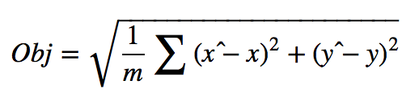
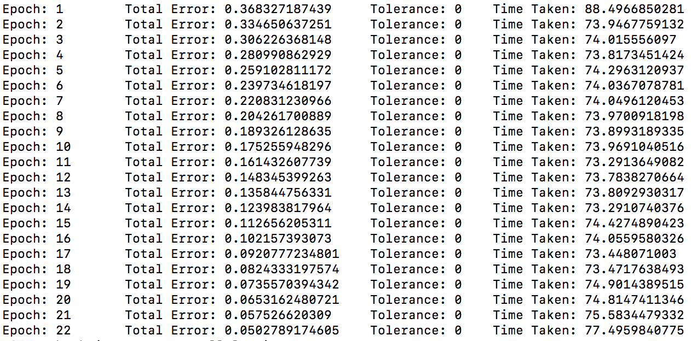

# Iphone Detection
#### Wenliang Zhao, wenliang.zhao.nyu@gmail.com

## Background
This program is used for iphone detection -- finding the center coordinates of a iphone in a 326*490 jpg image. It is a variation of typical object localization problem. We assume there must be one and only iphone in an image.  
  
There are 129 images for training, and all of them are from real camera from different angles.

## Model Strategy

### Foundamental Model
We consider this problem as a regression problem -- given a series of features (independent variables), train a regression to fit the labels (dependent variable), x, y coordinates of iphone center. This is very similar to bounding box regression which has 4 dependent variables.

### Feature Engineering
The initial features are the pixel values of an image. It is trivial to use deep CNN to extract large amount of non-linear features.   

1. VGG. 
I tried a pretrained vgg model which can be downloaded [here](https://github.com/machrisaa/tensorflow-vgg). 
The result is not good, which likely due to two reasons: one is this application is special for iphone detection using real camera; another may be vgg model is two deep and we only have 129 images for training.  

2. 6-layer CNN. 
This is a 6-layer CNN model. Each layer contains a convolution layer with ReLU activation, and end with a max pooling module. There is also optional normalzation layer which will be discussed in the later section. I simply choose 5*5 kernel size with 3 filters in each layer. Pool size is chosen as 2-by-2. Following the conv layers, there is one fully connected layer with sigmoid activation to get prediction between 0 and 1 

### Pooling.  
Both mean and max pooling are tested and max pooling is over performed. 

### Normalization
I tried 2 normalization methods. First is z-score  normalization (```normalize.py```) for each pixel during pre-processing. The second is layer normalization. Results shows layer normalization is better and the training using layer normalization is significantly faster than z-score.  

### Data Enrichment
More data is always helpful for machine learning training process. I use rotation to produce more data -- rotate a random angle of original image, get the new center coordinates in rotated image. Then scale up/down the rotated image to the same size of original image, the center coordinates also need to re-scale. I used rotated images for several models and it significantly improve the training quality. For the final suggested model, I didn't have enough time to train on rotated images because the training takes much longer.  
*** Note that to use rotation data, need to change the path in train_iphone_finder.py accordingly. The default duplication rate is 10 (n_copy = 10) in rotate.py

### Regularization
I tried both L1 and L2 regularization. L1 over performs L2. This likely due to comparing to the training data size, there are much more features. So that sparsity (L1) is important than shrinkage (L2). I didn't have time to compare L1 regularization with no regularization models for the best architecture.

### Optimizer
I tried valila gradient descent, Adam and Adadelta. Adadelta is slightly better.

### Training Objective


which is: square root of average summation of square errors of x and y prediction. 

An example (the 6 layer CNN described above) of training loss plot is shown below. Notice that Obj = 0.05 means in averge the x or y prediction error is less 0.05 (obj is summation of these two error)


      
## Future Work
1. Explore the classification method -- proposal region
2. When the scale of images change significantly -- large iphone Vs small iphone, how to extract stable feature is interesting question to me
3. When the viewing angle is extreme, how to extract stable feature
4. Some images are blurry, how to extract stable feature on this? One idea may be also add some degree of blurry to original features. This may be related to GAN? 
 
